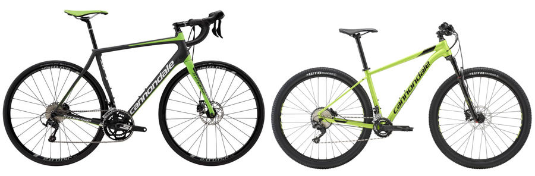
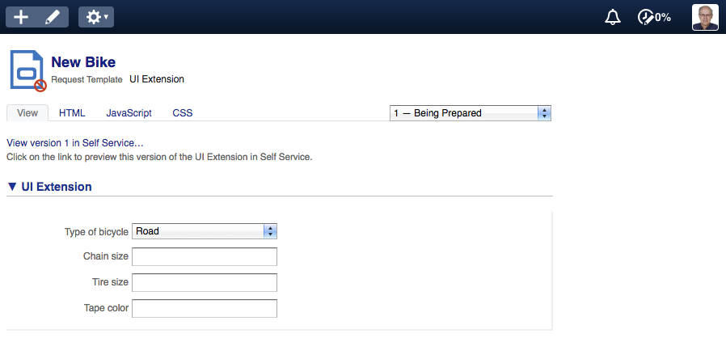

## Exercise 1: initial UI extension

Assume your organization allows new employees to select and customize a bike.
You are asked to create a UI extension that allows the new employee to select
the type of bike and also select specific parts for each type of bike.

Some parts are specific for a certain type of bike and should only be shown for
that type of bike. Others are generic and should be shown for every type of
bike.

There are two type of bikes a new employee can choose from: a road bike or a
mountain bike.

The following parts can be specified for each bike:

* Road bike
  * Chain size
  * Tire size
  * Tape color
* Mountain bike
  * Chain size
  * Tire size
  * Front shocks

All parts can be specified using free text.

### Exercise

First, create a new UI extension called "New bicycle" in the "wdc" account. We
will keep building on this UI extension through this set of exercises.

Link the UI extension to the
"[Personal computer for new employee](https://wdc.4me-demo.com/request_templates/195)"
Request Template. You can also rename the template into "Bicycle for new
employee".

Now implement the UI extension according to the above description. It should
look like this when you are done:

Selecting the "Mountain" option from the "Type of bicycle" field should display a
different set of fields.

When you want to test your UI extension, press "Save" and open the "UI
extension" section to play around with it.

Good luck!

[Continue to answer.](answer-01-initial-ui-extension.md)
