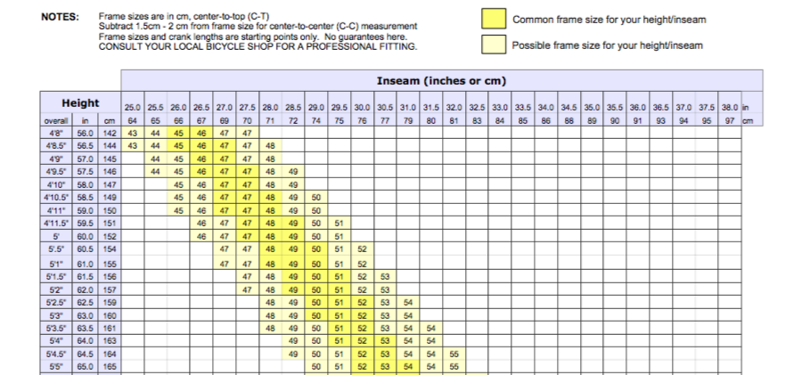

## Exercise 5: Using dynamic options

It turns out that bicycles come in all kinds of different frame sizes and these
sizes differ for every type of bike.

You are asked to replace the free text field for 'Size' by a select with the
following options:

* When type 'Road' is selected show sizes 44 to 66.
* When type 'Mountain' is selected show sizes 13 to 22.
* When type 'Recumbent' is selected there are only one size: 42

### Exercise

Implement requirement without specifying the select options in HTML.

You can use the jQuery `$element.html(htmlString)` function to set the HTML
contents of the element referenced by `$element`.

Good luck!

[Continue to answer.](answer-05-using-dynamic-options.md)
