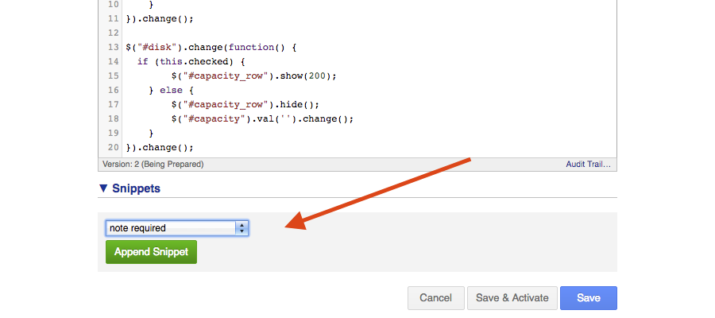

## Exercise 8: Using extensions API

Last requirements!

The type of bicycle that was selected by the employee should not be allowed to
change after it has been provided initially.

Also, when the status is set to "Completed" the specialist should be required
to attach a PDF containing a signed form that the new employee received the
bicycle.

### Exercise

Implement the requirements.

Take a look at the code generated by the snippets in the UI extension JavaScript
tab.

Good luck!

[Continue to answer.](answer-08-using-extensions-api.md)
