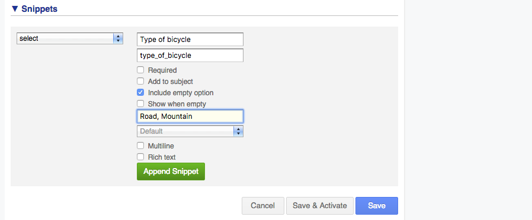

## Answer Exercise 1

### HTML

``` html
<div class="row vertical">
  <label for="type_of_bicycle" title="Type of bicycle">Type of bicycle</label>
  <select id="type_of_bicycle">
    <option value=""></option>
    <option value="road">Road</option>
    <option value="mountain">Mountain</option>
  </select>
</div>

<div class="row vertical">
  <label for="chain_size" title="Chain size">Chain size</label>
  <input id="chain_size" type="text" autocomplete="off">
</div>

<div class="row vertical">
  <label for="tire_size" title="Tire size">Tire size</label>
  <input id="tire_size" type="text" autocomplete="off">
</div>

<div class="row vertical">
  <label for="front_shocks" title="Front shocks">Front shocks</label>
  <input id="front_shocks" type="text" autocomplete="off">
</div>

<div class="row vertical">
  <label for="tape_color" title="Tape color">Tape color</label>
  <input id="tape_color" type="text" autocomplete="off">
</div>
```

The above HTML was created by using the snippets that are available when viewing the
HTML tab. For example, the following screenshot shows the settings to create the
select field:



### JavaScript

``` js
var $ = ITRP.$;            // jQuery
var $extension = $(this);  // The UI extension container with custom HTML

var $bicycleType    = $("#type_of_bicycle", $extension);
var $chainSizeRow   = $("#chain_size", $extension).closest(".row");
var $tireSizeRow    = $("#tire_size", $extension).closest(".row");
var $frontShocksRow = $("#front_shocks", $extension).closest(".row");
var $tapeColorRow   = $("#tape_color", $extension).closest(".row");

$bicycleType.change(function() {
  if (this.value === "road") {
    $chainSizeRow.show();
    $tireSizeRow.show();
    $frontShocksRow.hide();
    $tapeColorRow.show();

  } else if (this.value === "mountain") {
    $chainSizeRow.show();
    $tireSizeRow.show();
    $frontShocksRow.show();
    $tapeColorRow.hide();

  } else {
    $chainSizeRow.hide();
    $tireSizeRow.hide();
    $frontShocksRow.hide();
    $tapeColorRow.hide();
  }
}).change();
```

Not a lot of code, but definitely a lot to talk about.

---

First, let's discuss the two lines that are automatically added to the JavaScript
of every UI extension.

``` js
var $ = ITRP.$;            // jQuery
var $extension = $(this);  // The UI extension container with custom HTML
```

This first line ensures that the jQuery library version is the one supported by the
4me application. The second line stores a reference to the UI extension container
element in a variable name `$extension`.

The following screenshot shows the part of the page that is referenced by the
`$extension` variable:


The reference should be used to scope every element lookup using jQuery. For
example, if you want to get a reference to the `#foo` element you can use:

* `$extension.find('#foo')`, or
* `$('#foo', $extension)`

Scoping your lookups:

* improves performance by limiting the part of the DOM to traverse, and
* avoids accidentaly selecting an element that does not belong to your UI
  extension.

---

The following lines create a variable for each DOM element that we use in the rest of
the code:

``` js
var $bicycleType    = $("#type_of_bicycle", $extension);
var $chainSizeRow   = $("#chain_size", $extension).closest(".row");
var $tireSizeRow    = $("#tire_size", $extension).closest(".row");
var $frontShocksRow = $("#front_shocks", $extension).closest(".row");
var $tapeColorRow   = $("#tape_color", $extension).closest(".row");
```

Using the variable avoids having to perform the same lookup multiple
times. For example, take a look at the following code:

``` js
$("#bicycle_type").change(function() {
  $("#chain_size").hide()
})
```

This will lookup the `#chain_size` element each time the type of bicycle is
changed. The lookup does not take a lot of time, but we should avoid extra work
where possible.

Also, note that each lookup is scoped to the `$extension` element.

---

The next lines register a `onChange` event listener on the "Type of bicycle" field:

``` js
$bicycleType.change(function() {
  ...
}).change();
```

This will get called every time a different option is selected.

The extra `change()` at the end triggers a the `change` event on the "Type of
bicycle" field. This makes sure the function is called when initializing the UI
extension.

When calling a jQuery function on an element, it will return the element again.
This allows you to chain multiple functions, which is used in the above code. We
could also have written it as follows:

``` js
$bicycleType.change(function() {
  ...
})
$bicycleType.change();
```

---

Within the `change` function, a simple if/else-statement checks the selected value and performs the corresponding block:

``` js
if (this.value === "road") {
  ...
} else if (this.value === "mountain") {
  ...
} else {
  ...
}
```

The `this` variable contains the DOM element, it is not wrapped by jQuery. If
you are more comfortable using jQuery, you could've written this as follows:

``` js
var $this = $(this);
if ($this.val() === "road") {
  ...
} else if ($this.val() === "mountain") {
  ...
} else {
  ...
}
```

---

The last part to discuss is simple enough:

``` js
$chainSizeRow.show();
$tireSizeRow.show();
$frontShocksRow.hide();
$tapeColorRow.show();
```

This shows/hides the rows for a selected bicycle type.

Adding a duration (in milliseconds) to the `show` and `hide` functions will
create a animation. They look nice, but actually perform terribly on older
clients.

[Continue to the next exercise.](02-using-css.md)
